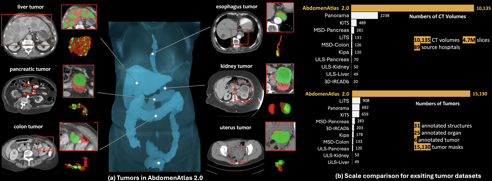

<div align="center">
  
</div>

<h1 align="center" style="font-size: 60px; margin-bottom: 4px">AbdomenAtlas2.0: The Multi-Tumor Segmentation Dataset</h1>

<div align="center">


[](https://github.com/BodyMaps/AbdomenAtlas2.0?tab=readme-ov-file#pants-dataset)
[](https://github.com/BodyMaps/AbdomenAtlas2.0?tab=readme-ov-file#pants-benchmark)
[](https://github.com/BodyMaps/AbdomenAtlas2.0?tab=readme-ov-file#pants-model) <br/>

[](https://github.com/BodyMaps/AbdomenAtlas2.0/stargazers) 
<a href="https://twitter.com/bodymaps317">
        
</a><br/>  

</div>


We present **AbdomemAtlas2.0** (The Multi-Tumor Segmentation Dataset) recently created by JHU. It is a large-scale, multi-institutional dataset, containing **10,135** CT scans with **15,130** tumors annotated across six organs and **5,893** controls. The AI ranks first in Medical Segmentation Decathlon (MSD).
# Paper

<b>Scaling Tumor Segmentation: Best Lessons from Real and Synthetic Data</b> <br/>
[Qi Chen](https://qic999.github.io/), [Xinze Zhou](), ...,[Yefeng Zheng](https://sites.google.com/site/yefengzheng/), [Ling Shao](https://ling-shao.github.io/), [Alan Yuille](https://www.cs.jhu.edu/~ayuille/), [Zongwei Zhou](https://www.zongweiz.com/)<sup>★</sup> <br/>
Johns Hopkins University <br/>
ICCV 2025 <br/>

<a href='https://www.zongweiz.com/dataset'></a> <a href='https://arxiv.org/pdf/2510.14831'></a>

# AbdomenAtlas2.0 Dataset

```shell
git clone https://github.com/BodyMaps/AbdomenAtlas2.0.git
cd AbdomenAtlas2.0
bash download_AbdomenAtlas2.0_ct.sh # It needs ~400GB storage
wget http://www.cs.jhu.edu/~zongwei/dataset/AbdomenAtlas2.0Mini_label.tar
```

#### Official training and Validation set
- AbdomenAtlas2.0 (*n*=10,135)

#### External *out-of-distribution* test set


- Proprietary **JHH Pancreatic Dataset**
- **[3D-IRCADb Dataset](https://www.ircad.fr/research/data-sets/liver-segmentation-3d-ircadb-01/)**
- **[PANORAMA Dataset](https://panorama.grand-challenge.org/)**
- **[Kipa Dataset](https://kipa22.grand-challenge.org/)**

# AbdomenAtlas2.0 Benchmark

> [!NOTE]
> We will call for comprehensive baseline methods. 

| model  | paper | github | P-Sen<sup>†</sup> | T-Sen<sup>‡</sup> | Spe | AUC | DSC |
|:---|:---|:---|:---:|:---:|:---:|:---:|:---:|
| nnU-Net | [](https://arxiv.org/abs/1809.10486) | [](https://github.com/MIC-DKFZ/nnUNet)
| SuPreM | [](https://arxiv.org/abs/2501.11253) | [](https://github.com/MrGiovanni/SuPreM)
| Models Genesis | [](https://arxiv.org/abs/2004.07882) | [](https://github.com/MrGiovanni/ModelsGenesis)
| Universal Model | [](https://arxiv.org/abs/2301.00785) | [](https://github.com/ljwztc/CLIP-Driven-Universal-Model)
| UNet++ | [](https://arxiv.org/abs/1912.05074) | [](https://github.com/MrGiovanni/UNetPlusPlus)
| TransUNet | [](https://arxiv.org/abs/2102.04306) | [](https://github.com/Beckschen/TransUNet)
| MedNeXt | [](https://arxiv.org/pdf/2303.09975) | [](https://github.com/MIC-DKFZ/MedNeXt)
| MedFormer | [](https://arxiv.org/abs/2203.00131) | [](https://github.com/yhygao/CBIM-Medical-Image-Segmentation)
| UniSeg | [](https://arxiv.org/abs/2304.03493) | [](https://github.com/yeerwen/UniSeg)
| LHU-Net | [](https://arxiv.org/abs/2404.05102) | [](https://github.com/xmindflow/LHUNet)

<sup>†</sup> **Patient-wise sensitivity**: A case is considered a true positive if the model detects one or more tumors in a patient who has any tumor, regardless of whether the predicted location is accurate.  <br/>
<sup>‡</sup> **Tumor-wise sensitivity**: A tumor is considered a true positive only if it is correctly localized. Patients with multiple tumors can contribute multiple true positives.

# AbdomenAtlas2.0 Model 

> [!NOTE]
> We will release more checkpoints as we receive permission from the respective authors. Stay tuned!

# Citation

```
@inproceedings{chen2025scaling,
  title={Scaling Tumor Segmentation: Best Lessons from Real and Synthetic Data},
  author={Chen, Qi and Zhou, Xinze and Liu, Chen and Chen, Hao and Li, Wenxuan and Jiang, Zekun and Huang, Ziyan and Zhao, Yuxuan and Yu, Dexin and He, Junjun and others},
  booktitle={Proceedings of the IEEE/CVF International Conference on Computer Vision},
  pages={24001--24013},
  year={2025},
  url={https://github.com/BodyMaps/AbdomenAtlas2.0}
}
```

# Acknowledgement

This work was supported by the Lustgarten Foundation for Pancreatic Cancer Research, the Patrick J. McGovern Foundation Award, and the National Institutes of Health (NIH) under Award Number R01EB037669. We would like to thank the Johns Hopkins Research IT team in [IT@JH](https://researchit.jhu.edu/) for their support and infrastructure resources where some of these analyses were conducted; especially [DISCOVERY HPC](https://researchit.jhu.edu/research-hpc/). Paper content is covered by patents pending.
